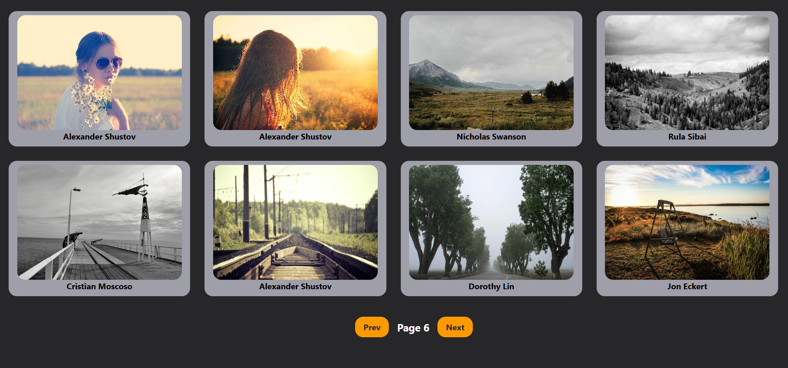

# React Gallery Project

A simple image gallery built with **React**, **Axios**, and **TailwindCSS** that fetches photos from the [Picsum API](https://picsum.photos/) and displays them in a grid layout with pagination controls.

---

## 🚀 Features
- Fetches images dynamically from the Picsum API  
- Displays images in a responsive grid  
- Pagination with **Prev/Next** buttons  
- Reusable `Card` component for each image  
- Reusable `PaginationButton` component for navigation  
- Loading state indicator  

---

## 🛠️ Tech Stack
- React (Functional Components + Hooks)  
- Axios (API requests)  
- TailwindCSS (styling)  

---

## 📦 Installation

1. Clone the repository:
   ```bash
   git clone https://github.com/your-username/gallery-project.git
   ```

2. Navigate into the project folder:
   ```bash
   cd gallery-project
   ```

3. Install dependencies:
   ```bash
   npm install
   ```

4. Start the development server:
   ```bash
   npm run dev
   ```

---

## 📸 Preview
The app fetches **12 images per page** and allows navigation using **Prev/Next** buttons.


---

## 🔮 Future Improvements
- Add total page count and disable **Next** on the last page  
- Add spinner animation for loading state  
- Add error handling with retry option  
- Implement infinite scroll  